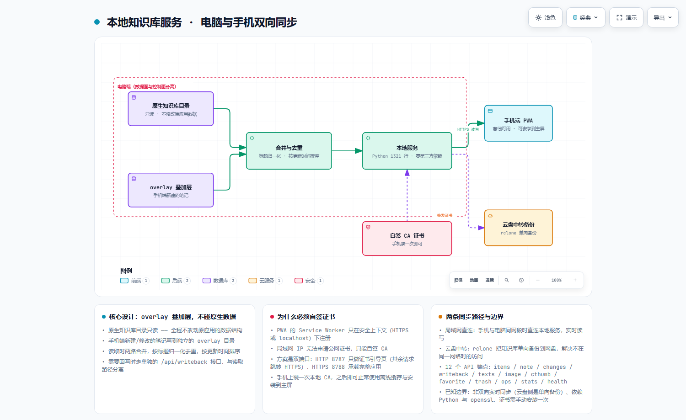

# 本地知识库服务 · 电脑与手机双向同步

> 把电脑上某个桌面应用的知识库，通过**局域网直连 + 云盘中转**两条路径同步到手机，
> 手机端是一个可离线、可安装到主屏的 PWA。
>
> 服务端 Python **1,321 行**，零第三方依赖；前端 PWA **1,878 行**，无构建步骤。

---

## 一、要解决什么

桌面应用的知识库只在自己电脑上。手机想看、想记，就得：

1. **能看到** —— 手机上浏览电脑里的笔记、图片、索引
2. **能写入** —— 手机上新建的笔记要能回到电脑，不能只读
3. **不打乱原数据** —— 绝不能因为手机端操作把原应用的数据搞坏
4. **不在同一网络时也能用** —— 出门在外时有个兜底通道

第 3 条是这个项目的设计原点：**对上游数据只读，手机端的改动写到独立区域。**

---

## 二、架构



> 可缩放 / 可导出 SVG 的交互版本：[`docs/architecture.html`](docs/architecture.html)
> 图源规格：[`docs/architecture.json`](docs/architecture.json)

---

## 三、核心设计：overlay 叠加层

这是整个项目最值得讲的一点。

```
原生知识库目录（只读）──┐
                        ├──► 合并 → 去重 → 排序 ──► 对外提供
overlay 目录（可写）────┘
```

**做法**：手机端新建或修改的笔记，写到独立的 `overlay/` 目录，**不碰原生目录一个字节**。

读取时两路合并：
- 原生目录 → 标记为 `local`
- overlay 目录 → 标记为 `app`（表示来自应用端）
- 去重用**标题归一化**（`norm_title`），避免"同一篇笔记因标题空格差异变成两条"
- 排序按更新时间

需要写回原生结构时，走**单独的** `/api/writeback` 接口，与读取路径分开。

**为什么这么设计**：

如果直接让手机端写原生目录，一旦格式有偏差，原应用可能直接读不了自己的数据——
用户会认为是"同步工具把我的笔记搞坏了"。用 overlay 把风险隔离在一侧，
**最坏情况是手机端笔记丢了，原数据始终完好**。

这个取舍在工程上很重要：**可靠性优先于功能完整性。**

---

## 四、为什么必须要自签证书

这是最容易卡住的一步，也是这个项目里唯一真正的技术门槛。

**问题**：PWA 的 Service Worker（离线缓存、安装到主屏）**只在安全上下文下注册** ——
也就是 HTTPS 或 `localhost`。而手机通过局域网 IP（如 `192.168.1.x`）访问电脑上的服务，
**IP 地址无法申请公网证书**。

**解法**：自签一套本地 CA。

| 端口 | 用途 |
|---|---|
| HTTP **8787** | 只做证书引导页（手机上安装本地 CA 用），其余请求自动 301 跳转 HTTPS |
| HTTPS **8788** | 承载完整应用：PWA 页面、数据接口、同步接口 |

流程：

1. 服务首次启动时用 `openssl` 自动生成 CA 与服务器证书（放在 `data/certs/`，不入库）
2. 手机浏览器访问 `http://<电脑IP>:8787`，按引导页提示安装 CA 证书
3. 之后走 `https://<电脑IP>:8788`，Service Worker 正常注册，PWA 可安装到主屏

**双端口设计的原因**：证书没装之前 HTTPS 会被浏览器拦截，所以必须留一个 HTTP 口
专门发证书。这个顺序不能反过来。

---

## 五、两条同步路径

| 路径 | 场景 | 机制 |
|---|---|---|
| **局域网直连** | 手机与电脑同一网络 | 直连本地服务，实时读写，走 overlay 合并 |
| **云盘中转** | 不在同一网络 | `rclone` 把知识库**单向备份**到云盘，手机端用云盘 App 查看 |

云盘那条是**单向备份而非双向同步**——因为双向同步会引入冲突解决，而两份数据在
两端都可写时，冲突合并是个远比看起来复杂的问题。选择单向是刻意的简化：
**保证不丢数据，代价是云盘侧不实时。**

备份脚本按内容类型分 5 步执行（笔记正文 / 封面缩略图 / 小缩略图 / 索引库 / 手机端笔记），
每步独立、可中断续传（`rclone copy` 天然幂等，已传的不重传）。

---

## 六、技术栈与结构

| 层 | 技术 |
|---|---|
| 服务端 | Python 3.8+（标准库 `http.server` / `ssl` / `gzip` / `json`），**零第三方依赖** |
| 可选依赖 | Pillow（图片压缩）、openssl（自动生成证书） |
| 前端 | 原生 JS + Service Worker + Web App Manifest，**无构建步骤** |
| 云端备份 | rclone（外部工具，按需调用） |

```
local-kb-server/
├── kb-server/
│   ├── server.py            # 服务端 1,321 行
│   │                        #   HTTPS 8788 完整应用
│   │                        #   HTTP  8787 证书引导
│   └── web/                 # 手机端 PWA
│       ├── index.html       # 应用主体 1,878 行
│       ├── sw.js            # Service Worker（离线缓存）
│       ├── manifest.webmanifest
│       └── icons/
├── gdrive-sync/
│   ├── 1-连接Google账号.bat      # 一次性授权
│   ├── 2-同步到Google网盘.bat    # 分 5 步备份，可中断续传
│   ├── rclone.conf.example      # 配置模板（真实凭据不入库）
│   └── 使用说明_Google网盘同步.txt
└── docs/architecture.*
```

### 12 个 API 端点

```
/api/items      列表（合并后的全量视图）      /api/note      单篇读写
/api/changes    增量变更                      /api/writeback 回写原生结构
/api/texts      文本内容                      /api/image     图片
/api/cthumb     封面缩略图                    /api/favorite  收藏
/api/trash      回收站                        /api/ops       批量操作
/api/stats      统计（含缓存与 overlay 体积） /api/health    健康检查
```

---

## 七、快速开始

```bash
# 1. 指定上游知识库目录（按你的实际环境）
#    Windows cmd:
set KB_BASE_DIR=C:\ProgramData\<应用名>\user\<你的用户ID>
#    PowerShell:
$env:KB_BASE_DIR="C:\ProgramData\<应用名>\user\<你的用户ID>"

# 2. 启动服务（首次会自动生成自签证书，需要 openssl 在 PATH 上）
python kb-server/server.py

# 3. 手机浏览器访问 http://<电脑IP>:8787 按引导装证书
#    然后访问 https://<电脑IP>:8788 使用；可"添加到主屏"当 App 用

# 4. 可选：云盘备份
#    先跑 1-连接Google账号.bat 授权，之后每次跑 2-同步到Google网盘.bat
```

> 上游目录通过 `KB_BASE_DIR` 环境变量指定，**不同应用与账号路径不同**，所以源码里
> 不写死。默认值指向用户目录下的 `kb-data`。

---

## 八、已知边界（诚实写在这里）

1. **云盘侧是单向备份**，不是双向同步。出门在外时只能查看，改动要回到局域网才能提交。
2. **没有冲突检测**。overlay 与原生目录如果出现同名笔记，靠标题归一化去重，
   但"两边都改过同一篇"这种情况没有做三方合并。
3. **依赖自签证书的手动安装**。iOS / Android 对用户安装的 CA 有额外信任设置步骤，
   首次配置对非技术用户有门槛。
4. **无鉴权**。服务只在局域网内监听，任何能访问该 IP 的设备都能读写。
   放到公网必须先加认证（这是明确的未做项，不是遗漏）。
5. **单用户设计**，没有多账号隔离。
6. **服务端是单线程 HTTPS**（`http.server` 基类），并发高时会阻塞；
   个人自用够，多人用需要换 WSGI/ASGI。

---

## License

MIT
